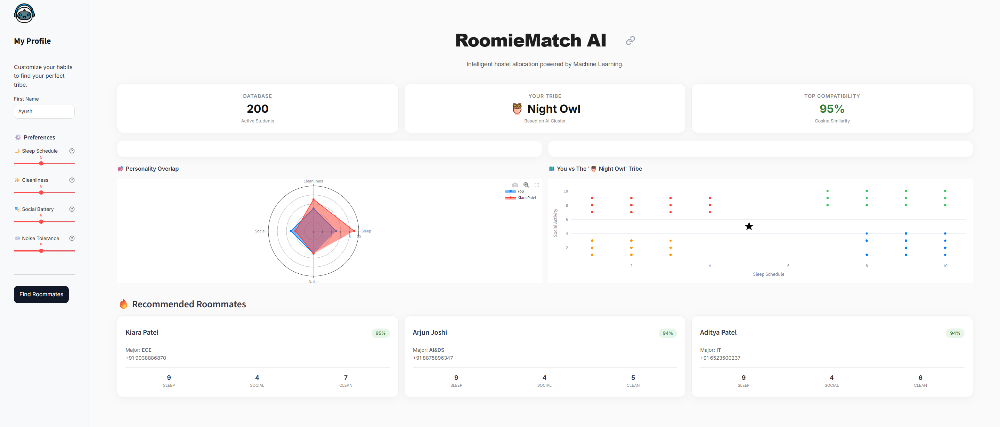

# 🏠 RoomieMatch AI


**RoomieMatch AI** is an intelligent roommate recommendation system designed to solve the problem of random hostel allocation. By utilizing **Unsupervised Machine Learning**, the system clusters students based on their living habits and recommends the most compatible roommates using mathematical similarity.

## 🚀 Key Features

* **Behavioral Profiling:** Users input preferences for Sleep Schedule, Cleanliness, Social Battery, and Noise Tolerance.
* **AI-Powered Clustering:** Uses **K-Means Clustering** to segregate users into distinct "Tribes" (e.g., Night Owls, Scholars).
* **Smart Matching:** Uses **Cosine Similarity** to calculate a precise compatibility percentage (0-100%) between users.
* **Interactive Dashboard:** A professional UI built with Streamlit featuring Radar Charts and Apple-inspired design cards.
* **Synthetic Data Generation:** Includes a fallback mechanism to generate synthetic student data using NumPy if no database is found.

## 🛠️ Tech Stack

| Component | Tool | Purpose |
| :--- | :--- | :--- |
| **Language** | Python | Core logic and backend scripting. |
| **Frontend** | Streamlit | Web interface and state management. |
| **ML Models** | Scikit-Learn | K-Means (Clustering) & Cosine Similarity (Ranking). |
| **Data Handling** | Pandas & NumPy | Data manipulation and vector operations. |
| **Visualization** | Plotly | Interactive Radar and Scatter plots. |

## ⚙️ How It Works (The Logic)

1.  **Data Ingestion:** The system takes 4 numerical inputs (1-10 scale) from the user.
2.  **Vectorization:** Inputs are converted into a feature vector: $V = [Sleep, Clean, Social, Noise]$.
3.  **Clustering:** The pre-trained **K-Means** algorithm assigns the user to one of 4 clusters based on the nearest centroid.
4.  **Similarity Ranking:** The system filters users within that cluster and calculates the **Cosine Similarity** score to rank the top 3 best matches.

## 📸 Screenshots



## 📦 How to Run Locally

1.  **Clone the Repository**
    ```bash
    git clone [https://github.com/your-username/RoomieMatch-AI.git](https://github.com/your-username/RoomieMatch-AI.git)
    cd RoomieMatch-AI
    ```

2.  **Install Dependencies**
    ```bash
    pip install -r requirements.txt
    ```

3.  **Run the App**
    ```bash
    streamlit run app.py
    ```

## 🔮 Future Scope

* **Spring Boot Integration:** Migrating the backend to Java Spring Boot for Microservices architecture.
* **Database:** Connecting to an Oracle/MySQL database for persistent user storage.
* **Advanced ML:** Implementing the "Stable Marriage Problem" algorithm for mutual matching.

---
*Created by Ayush Kumar Singh| B.Tech CSE Student*
